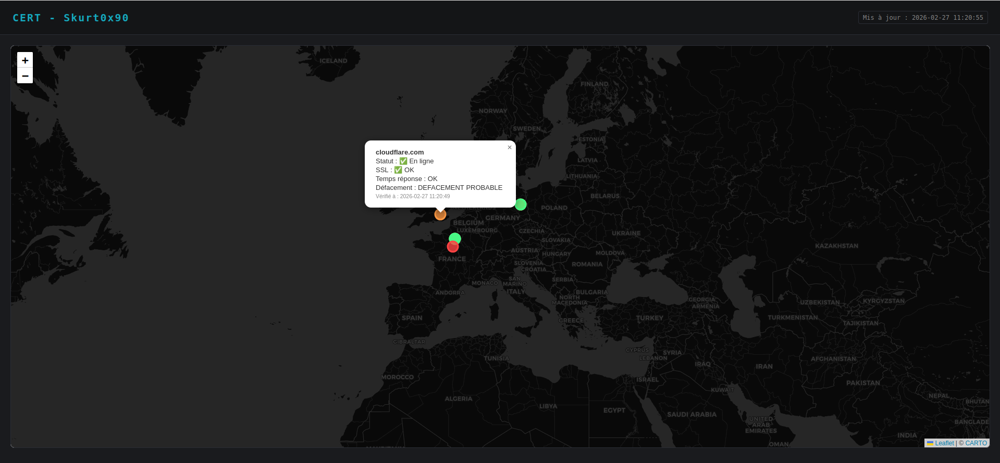

# 🛡️ Starter Kit CERT Aviation — POC

Ce projet est une implémentation personnelle inspirée de l'article **"Déploiement opérationnel d'un starter kit du CERT"** publié dans [MISC n°142](https://connect.ed-diamond.com/misc/misc-142/deploiement-operationnel-d-un-starter-kit-du-cert-retour-d-experience-et-outils-open-source-pour-la-surveillance-proactive). 


--- 
## Pré-requis
- [Docker](https://docs.docker.com/get-docker/) installé sur votre machine.
- [Docker Compose](https://docs.docker.com/compose/install/) installé (généralement inclus avec Docker Desktop).

---
## Lancement
```bash sudo docker compose up --build``` 


---
## Fonctionnalités

- **Web Watcher** — surveillance de la disponibilité des sites exposés :white_check_mark:
- **Defacement detection** — détection de modifications non autorisées sur les pages web :white_check_mark:
- **Ransomware Monitor** — veille sur les sites de leak de groupes ransomware
- **Social Monitor** — surveillance des réseaux sociaux et sources OSINT
- **Vuln Scanner** — scan de vulnérabilités sur les assets exposés
- **Alerting** — notifications en cas d'incident détecté
- **Dashboard** — centralisation et visualisation des résultats :white_check_mark:

---
## Screenshot


---

## Stack

- Python 3.12
- Docker / Docker Compose
- GitHub Actions + Codecov

---

## Licence

- MIT