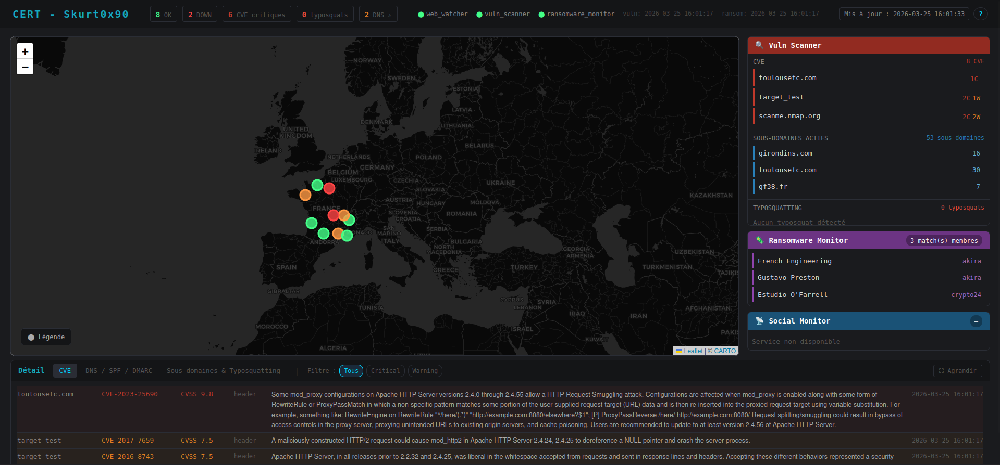
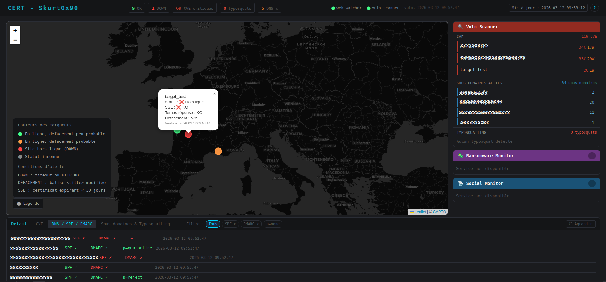
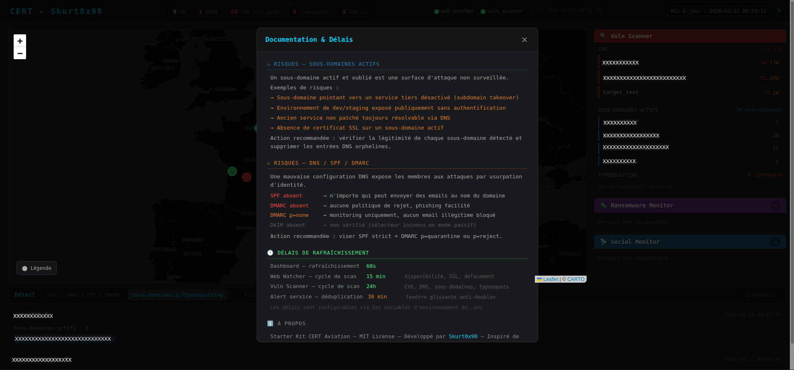

# 🛡️ Starter Kit CERT — POC

Ce projet est une implémentation personnelle inspirée de l'article **"Déploiement opérationnel d'un starter kit du CERT"** publié dans [MISC n°142](https://connect.ed-diamond.com/misc/misc-142/deploiement-operationnel-d-un-starter-kit-du-cert-retour-d-experience-et-outils-open-source-pour-la-surveillance-proactive).


[](https://python.org)
[](https://docker.com)
[](LICENSE)
[]()
[]()
[](https://github.com/Skurt0x90)

---

## Pré-requis

- [Docker](https://docs.docker.com/get-docker/) installé sur votre machine.
- [Docker Compose](https://docs.docker.com/compose/install/) installé (généralement inclus avec Docker Desktop).

---

## Lancement

```bash
sudo docker compose --profile test up --build
```

| Service             | URL                              | Attendu          |
|:--------------------|:---------------------------------|:-----------------|
| signal_cli          | http://localhost:8080/v1/about   | JSON version     |
| alert_service       | http://localhost:5005/health     | {"status":"ok"}  |
| web_watcher         | http://localhost:5001/health     | {"status":"ok"}  |
| web_watcher data    | http://localhost:5001/api/data   | JSON des sites   |
| vuln_scanner        | http://localhost:5002/health     | {"status":"ok"}  |
| vuln_scanner data   | http://localhost:5002/api/data   | JSON des CVE     |
| dashboard           | http://localhost:8050            | Interface Dash   |
| DVWA                | http://localhost:8888            | Interface DVWA   |
---

## Configuration

Copiez `.env.example` en `.env` et renseignez vos valeurs (SMTP, Signal...).

La liste des cibles à surveiller se définit dans `data/inputs/targets.txt` :

```
# domaine,longitude,latitude,label,scan_mode
exemple.fr,2.3522,48.8566,Paris,passive
monmembre.fr,2.3522,48.8566,Lyon,active
```

- `passive` (défaut) — surveillance non intrusive, aucune autorisation requise
- `active` — modules de scan supplémentaires, nécessite une convention avec le membre

---

## Fonctionnalités

- **Web Watcher** — surveillance de la disponibilité des sites exposés ✅
- **Defacement detection** — détection de modifications non autorisées sur les pages web ✅
- **Alerting** — notifications en cas d'incident détecté (email ✅ / signal ❌ enregistrement en attente)
- **Dashboard** — centralisation et visualisation des résultats ✅
- **Vuln Scanner** — surveillance passive de la surface d'attaque des membres 🔧
  - Détection de stack technique exposée dans les headers HTTP (croisement NVD/CVE) ✅
  - Enumération de sous-domaines via crt.sh ✅
  - Vérification SPF/DMARC ✅
  - Détection de typosquatting via dnstwist ✅
  - Mode `active` prévu pour les membres avec convention (Scan NMAP actif) ✅
- **Ransomware Monitor** — veille sur les sites de leak de groupes ransomware ❌
- **Social Monitor** — surveillance des réseaux sociaux et sources OSINT ❌

---

## Tests

Un service DVWA (Damn Vulnerable Web Application) est disponible pour tester le vuln_scanner sur une cible volontairement vulnérable, sans toucher aux vrais membres :

```bash
sudo docker compose --profile test up --build
```

DVWA sera accessible sur http://localhost:8888 et ajouté automatiquement dans les cibles du vuln_scanner en mode `passive` et `active`.

---

## Screenshot





---

## Stack

- Python 3.12 / Flask / APScheduler
- Docker / Docker Compose
- Dash / dash-leaflet / dash-mantine-components
- GitHub Actions + Codecov

---

## Licence

MIT